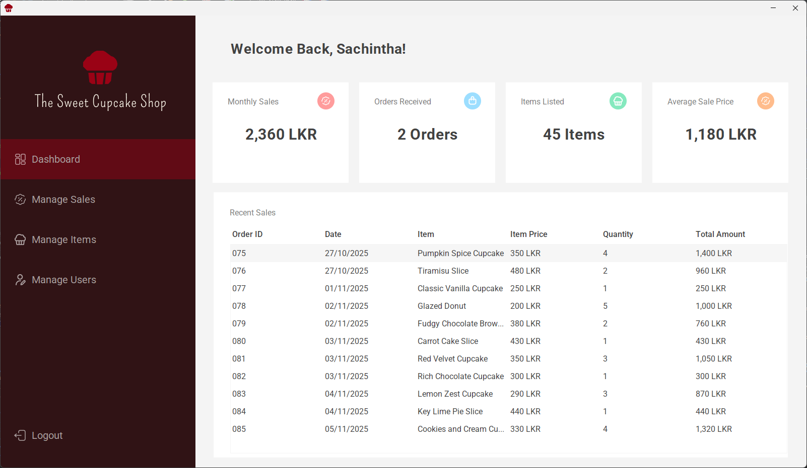

<p align="center">
  
</p>

<h1 align="center">The Sweet Cupcake Shop</h1>

<p align="center">A solution for simplifying operations within a modern bakery.</p>

---

<p align="center">
  
  
  
  
  
</p>

## 🌟 Introduction

**The Sweet Cupcake Shop** is a desktop application built as part of the **CSE4006 – Object Oriented Programming** module at ICBT Campus, with a goal of simplifying daily operations such as cupcake listing, order tracking, and user management of a modern bakery.

## 🎯 Project Objectives

- Simplify the bakery’s daily transaction process.
- Manage cupcake details, prices, and categories efficiently.
- Provide secure access levels for cashiers and managers.
- Demonstrate **Object-Oriented Programming** principles.

## 📸 Screenshots

**User Dashboard**: Displays monthly sales, recent sales, and inventory data.



## 👥 User Roles

#### 1. Cashier

Can view, add, and search cupcakes by category.

🔒 Default credentials:

```text
Email: janedoe@gmail.com
Password: #JaneDoe@98
```

#### 2. Manager

All cashier priviliages and the ability to manage user accounts.

🔒 Default credentials:

```text
Email: johndoe@gmail.com
Password: #JohnDoe@97
```

## 🚀 Getting Started

### Prerequisites

- Java JDK 17 or later
- Apache NetBeans

### Installation

Clone the project:

```java
git clone https://github.com/ShanukaRavishan/the-sweet-cupcake-shop.git
```

- Open the project using NetBeans
- Build and Run the project ✨

## 🧾 License

This project is licensed under the MIT License – see the [LICENSE](LICENSE)
file for details.

## ✨ Acknowledgements

- [FlatLaf](https://www.formdev.com/flatlaf/) for the elegant modern UI theme
- Inspired by real world bakery management system UI designs on [Dribble](https://dribbble.com/search/bakery-management-system)
- [SVG Repo](https://www.svgrepo.com) - For providing high quality SVG icons featured in the UI.
- [Awesome README Template by Louis3797](https://github.com/Louis3797/awesome-readme-template) - For the creative layout and design of README’s template.
